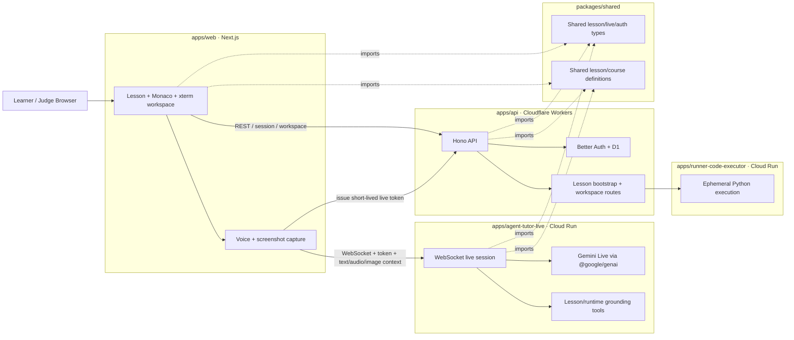

# Gemini Live Agent Architecture

This page is written for Gemini Live Agent Challenge judges.

`gemini-live-agent` is a coding workspace where the learner edits Python, runs real commands, and asks a live tutor for help. The tutor is grounded on the current lesson, the current code, the latest terminal output, and a screenshot of the visible workspace.

## What To Verify

- The learner-facing app is `apps/web`
- The lesson/runtime API is `apps/api`
- The execution backend is `apps/runner-code-executor`
- The live tutor runtime is `apps/agent-tutor-live`
- The live tutor backend is hosted on Google Cloud Run
- The execution backend is also hosted on Google Cloud Run

## System Diagram

## End-To-End Runtime Flow

1. The learner opens `/app` in `apps/web`.
2. `apps/web` requests a lesson workspace from `apps/api`.
3. `apps/api` returns lesson context, starter files, and the initial runtime snapshot.
4. When the learner runs code, `apps/api` sends the current lesson files and command to `apps/runner-code-executor`.
5. `apps/runner-code-executor` creates a fresh temp workspace, executes Python, and returns stdout/stderr.
6. `apps/api` normalizes that result into the runtime snapshot shape used by the UI.
7. When the learner asks for help, `apps/web` first requests a short-lived live-session token from `apps/api`.
8. `apps/web` sends the live tutor:
   - lesson context
   - current source code
   - latest command
   - latest stdout/stderr
   - screenshot of the visible workspace
   - audio or text input
9. `apps/agent-tutor-live` verifies the token during the WebSocket upgrade, enriches the turn, and forwards it to Gemini Live.
10. Gemini Live responds with transcript and audio output.
11. `apps/web` renders the tutor response in the learning rail.

## Why This Architecture Matters For Judging

This architecture is important because the tutor is:

- live
  - real-time WebSocket session, not a basic request/response chat box
- multimodal
  - hears the learner
  - speaks back
  - receives the visible workspace as an image
- grounded
  - lesson context
  - current code
  - latest command
  - terminal stdout/stderr
  - screenshot of the current workspace
- session-aware
  - short-lived live tutor token minted by `apps/api`
  - WebSocket accepted only after server-side token verification
- challenge-aligned
  - Gemini Live through the Google GenAI SDK
  - live tutor backend hosted on Google Cloud Run
  - code-execution backend hosted on Google Cloud Run

## Code Pointers

If you want to inspect the main surfaces directly:

- Web workspace:
  - `apps/web/src/features/live-mentor`
- Workspace bootstrap and runner-backed execution:
  - `apps/api/src/modules/lesson/workspace`
- Runner service:
  - `apps/runner-code-executor/src/index.ts`
- Live tutor entrypoint:
  - `apps/agent-tutor-live/src/index.ts`
- Gemini Live session creation:
  - `apps/agent-tutor-live/src/workflows/createLiveTutorSession.ts`
- Shared lesson/live contracts:
  - `packages/shared/src`
